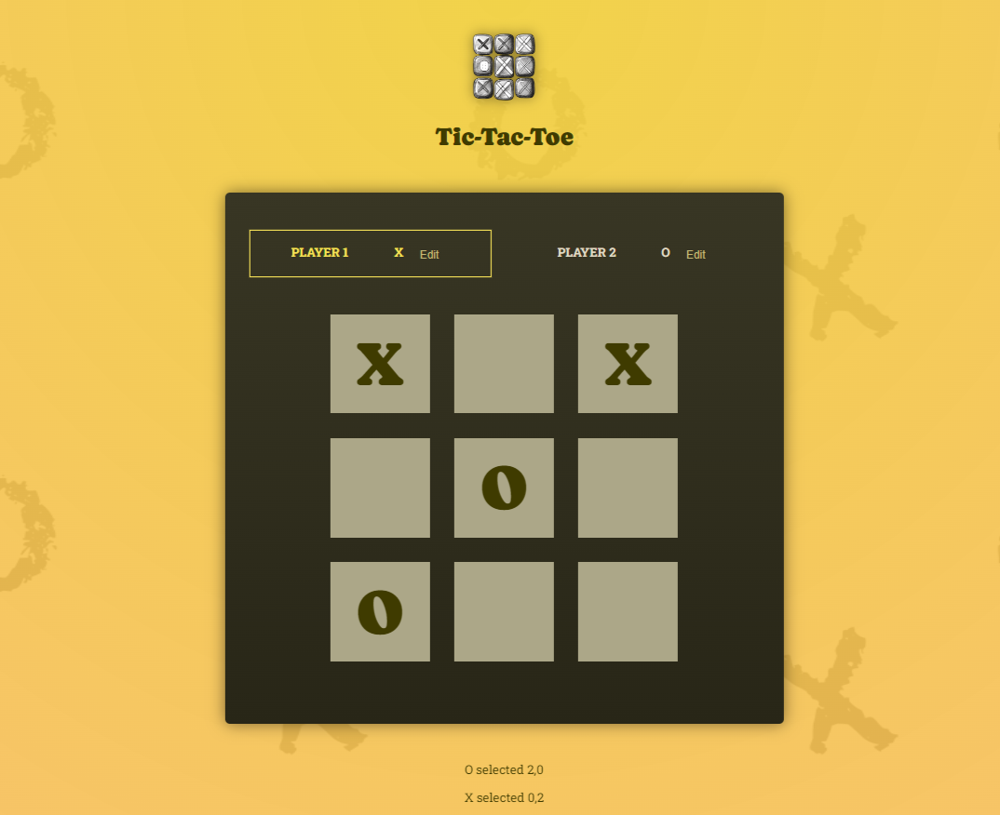

<h1 align="center">Tic-Tac-Toe</h1>
<p align="center">
    
 </p>

<h2 align="center">
Check out the <a href="https://srichandan-09.github.io/Tic-Tac-Toe-Project/" target="_blank">live Tic-Tac-Toe Game here</a>.
</h2>
<p align="left">
Tic-Tac-Toe game, a classic game for two players where each player takes turns marking a grid of 3x3 squares with their X or O. The player who succeeds in placing three of their marks in a horizontal, vertical, or diagonal row wins the game. It is also known as Noughts and Crosses or Xs and Os. The game is implemented using React and CSS
</p>

<p align="center">
  
</p>

## Game rules

1. The game is played on a grid that is 3 squares by 3 squares
2. You are X, your friend is O. Players take turns putting their marks in empty squares
3. The first player to get 3 of their marks in a row (up, down, across, or diagonally) is the winner
4. When all 9 squares are full, the game is over

## 🛠️ Technologies:

- React
- JavaScript
- CSS3
- Vite

## 🔧 Techniques:

- Two-Way Binding
- Lifting State Up
- Deriving & Sharing states across components
- Lifting computed values up
- Deriving computed Values from other computed values

---

# ✨ How to Get Started

## Clone Project:

```bash

git clone https://github.com/Srichandan-09/Tic-Tac-Toe-Project.git

```

## Install the Dependencies:

```bash

npm install

```

or in short

```bash

npm i

```

## Launch:

```bash

npm run dev

```

## Author

<b>👤 Srichandan</b>

- LinkedIn - [@Srichandan](https://www.linkedin.com/in/srichandan09)
- Github: [@Srichandan-09](https://github.com/Srichandan-09)

Feel free to contact me with any questions or feedback!

## Show your support

Give a ⭐️ if you liked this project!
